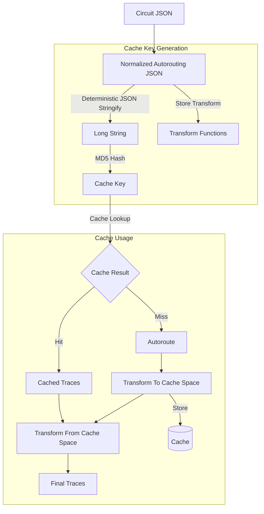

# autorouting-cache-engine

Generate a cache key(s) to enable re-using previous autorouting results.

```tsx
import { generateAutoroutingCacheKey } from "@tscircuit-internal/autorouting-cache-engine"
import circuitJson from "./circuit.json"

const { cacheKey, transformTracesToCacheSpace, transformTracesFromCacheSpace } =
  generateAutoroutingCacheKey(circuitJson, {
    subcircuit_id: "...",
  })

console.log(cacheKey)
// 938c2cc0dcc05f2b68c4287040cfcf71

// ------------- USAGE WITH CACHE -------------------

import myCachedTraces from "./cached-traces"

const cachedTraces = myCachedTraces.get(cacheKey)

if (!cachedTraces) {
  const newlyRoutedTraces = autoroute(circuitJson)
  const cacheSpaceTraces = transformTracesToCacheSpace(newlyRoutedTraces)
  myCachedTraces.set(cacheKey, cacheSpaceTraces)

  const circuitJsonWithTraces = circuitJson.concat(newlyRoutedTraces)
} else (cachedTraces) {
  // We found the traces in the cache! Let's use them!
  const traces = transformTracesFromCacheSpace(cachedTraces)

  const circuitJsonWithTraces = circuitJson.concat(traces)
}


```

You can now use this `cacheKey` to see if you've already routed this subcircuit,
and re-use the results!

The `cacheKeyTransform` represents how you need to transform the cached traces
to or from the cache space (the normalized space)

## Visual Overview



## Internals

### `NormalizedAutoroutingJson`

To generate a cache key, we first generate a `NormalizedAutoroutingJson`. A
`NormalizedAutoroutingJson` is a JSON object that contains a version of all
the obstacles/traces with rounded numbers. Serializing two different circuits
that have the same autorouting result should have the same `NormalizedAutoroutingJson`

Here's an example `NormalizedAutoroutingJson`:

```json
{
  "allowed_layers": 2,
  "nets_to_route": [1],
  "sorted_normalized_objects": [
    {
      "net": 1,
      "x": "0.00",
      "y": "0.00",
      "layers": [1],
      "width": "0.25",
      "height": "0.25"
    },
    {
      "type": "rect",
      "x": "3.00",
      "y": "3.00",
      "width": "1.00",
      "height": "2.00",
      "net": null
    },
    {
      "net": 1,
      "x": "6.00",
      "y": "6.00",
      "layers": [1],
      "width": "0.25",
      "height": "0.25"
    }
  ]
}
```

There are rules to make sure that `NormalizedAutoroutingJson` is always the
same for the same autorouting problem, these are the rules:

- Traces and obstacles are converted into `sorted_normalized_objects`
- All `mm` units are converted into strings with 2 decimal points
- All objects are sorted by `layers`, `x`, `y`, `width`, `height` in that order (asc)
- All connectivity nets (traces, nets etc.) are converted into a `net` number
  - The `net` numbers increment by their order in `sorted_normalized_objects`
  - If an object is in the same net as a previous object, use the previous `net`
    number
- Obstacles that are not connected to any trace should be given `"net": null`
- `nets_to_route` is a sorted array of integers indicating the nets to route
- `allowed_layers` indicates the layers that the autorouting is allowed to use
  for the solution
- The normalized objects are translated to be centered about the "region of interest" which is the smallest bounding box that contains all the nets to connect
- When creating NormalizedAutoroutingJson, you can specify a `marginOutsideOfRegionOfInterest` which indicates how far outside the region of
  interest to include obstacles. If an obstacle is outside the region of interest
  plus the `marginOutsideOfRegionOfInterest`, it will be ignored (it will not
  be included in the `NormalizedAutoroutingJson`)

### `LongString`

The `LongString` is a predictable JSON serialization to ensure that the
`NormalizedAutoroutingJson` is always turned into the same string.

To do predictable serialization, we mandate the following rules:

- All keys must be sorted when serializing
- No whitespace is allowed

You can use the [json-stringify-deterministic](https://www.npmjs.com/package/json-stringify-deterministic) library to create a `LongString` from `NormalizedAutoroutingJson`

```tsx
import deterministicStringify from "json-stringify-deterministic"

deterministicStringify(normalizedAutoroutingJson)
// { "nets_to_route": [ ....
```

### `CacheKey1`

The `CacheKey1` is an md5-encoded hash of the `LongString`. It can be used to
see if this autorouting problem has ever previously been solved against a cache.

md5 was selected for it's speed and popularity for checksums. There is not a
major security risk since this is used for caching, not password security.

```tsx
import { createHash } from "crypto"

const longString = deterministicStringify(normalizedAutoroutingJson)
const cacheKey1 = createHash("md5").update(longString).digest("hex")
// "5d41402abc4b2a76b9719d911017c592"
```
